# 官网

打包并运行的技术

它可以独立隔离运行，有人把它称作轻量级虚拟机，但它并没有虚拟层。

## 简单构架
   

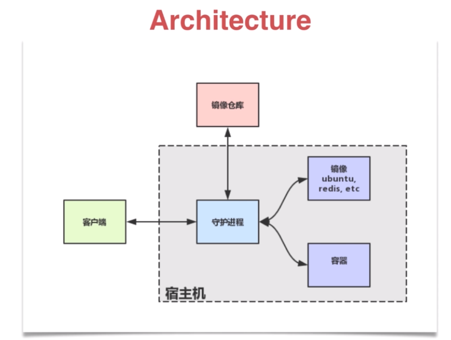

## 安装
[官网下载](https://www.docker.com/get-started)

如果是linux，建议将docker单独建立一个用户组，这样就不需要为了为了临时提升权限，
而使用sudo来提升了

便捷点：

<!--more-->

# 仓库

# 镜像

### 1.拉取镜像

**`docker [image] pull NAME [ :TAG] `** 
**尽量指定TAG，一般用来指定版本，不指定时选取laster，因为该版本可能会持续维护，并不稳定**

**其实拉取镜像的命令，完整形式应该包含默认的注册服务器，如：    
`docker pull ubuntu:18.04 ==> 默认 docker pull registry.hub.docker.com/ubuntu:18.04`  
如果在非官方的网站下载镜像，就需要填写完整地址**

有时需要使用镜像代理服务来加速获取镜像，这不同的系统请自行查询怎么设置

### 2.查看镜像
**查看镜像**

`docker images` 查看镜像信息，还有子命令-a,-f等

**修改名称**

`docker tag oldName:oldTag newName:newTag`  添加新的名称标签链接

**查看镜像详细信息**

`docker [image] inspect name:tag` 可以只看其中一项 

例如：`docker [image] inspect -f {{". Architecture"}} ubuntu:18.04`

**查看镜像历史和分层信息**

`docker history name:tag`

**搜索镜像** 

`docker search [option] keyword`

例如：    
官方搜索nginx    
`docker search --filter=is-official=true nginx`    
搜索超过4星，包含tensorflow字符的    
`dockersearch--filter=stars=4tensorflow`

### 3.创建镜像

**使用已有容器创建**

`docker [container] commit[OPTIONS] CONTAINER [REPOSITORY [:TAG]] `    
**-m**  信息    
**-a**  作者  

例如：     
`docker commit -m "add file" -m "chengqj" ID name:tag`

**基于模板导入**

`docker [image] import [OPTIONS] filelURLl-[REPOSITORY[:TAG ] ] `

基于模板导入首先要下载模板文件，然后使用`$cat ubuntu-18.04-x86_64-minimal.tar.gz | docker import - ubuntu:lB.04`        
也可以同载入镜像一样使用，当别人给你自己的镜像使用时，可以用这种方式导入，不过还是推荐使用 `docker load`

**基于Dockerfile文件的创建**

这是最常见的一种创建方式，java项目一般也采取这种方式创建docker镜像

`docker [image] -t name:tag`

Dockerfile文件格式

### 4.存出和载入镜像

**存出镜像**

`docker save -o d:/newName.tar name:tag`

这样就可以把镜像给别人用了

**载入镜像**

`docker [image] load`

**-i** 指定导入文件名

例如：docker load -i redis.tar

### 5.上传镜像

`docker [image] push NAME [:TAG] | [REGISTRY_HOST [ :REGISTRY_PORT] / ]NAME [:TAG ］`         

默认推向默认仓库，也可指定仓库，如：`docker push user/name:tag`     

推送前需要先修改tag，配合仓库查看，如：       
`docker tag oldName:tag user/newName:tag`     
`docker push user/newName:tag`

第一次使用的时候可能会需要输入用户名和密码

### 5.删除镜像

**删除镜像**

 `docker rmi IMAGE [IMAGE...]` IMAGE可以是tag或者id，**-f** 强制删除

**清除镜像临时文件**

`docker image prune`  **-f** 强制删除 **-a** 所有无用的临时的都删除

# 容器

### 1.查看容器

`docker ps -a `

### 2.创建容器并启动

`docker [container] create -it ubuntu:latest`

**-it**是以交互模式打开，下边会有解释

**创建的容器时停止状态，需要使用`docker start CONTAINER`命令启动**       

容器时Docker的核心技能，所以支持大量的选项,主要包含与容器运行模式，容器环境配置，
容器资源限制和安全保护相关。



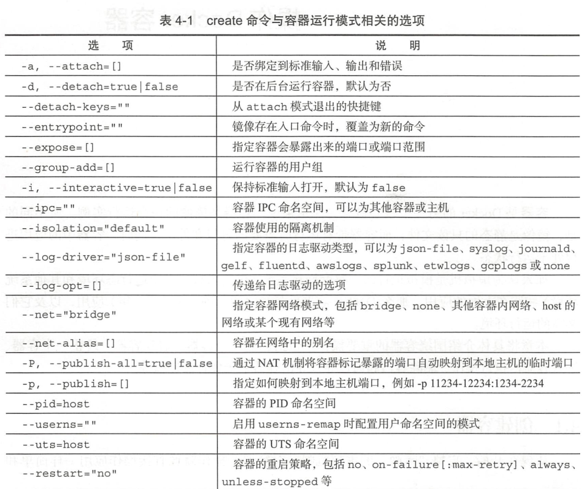 

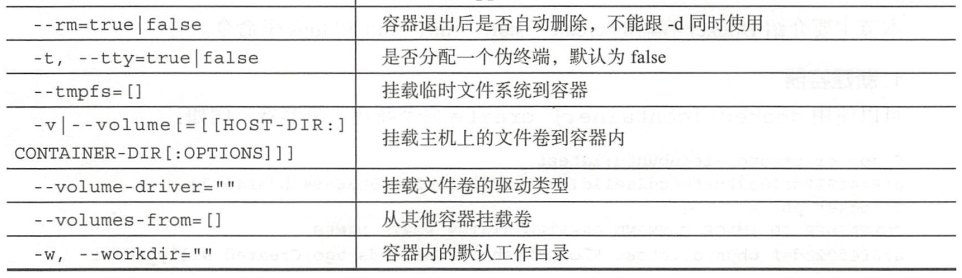 



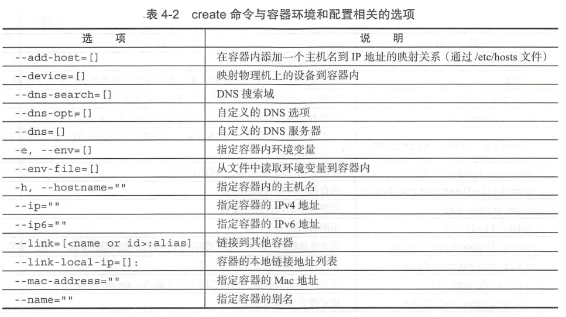 



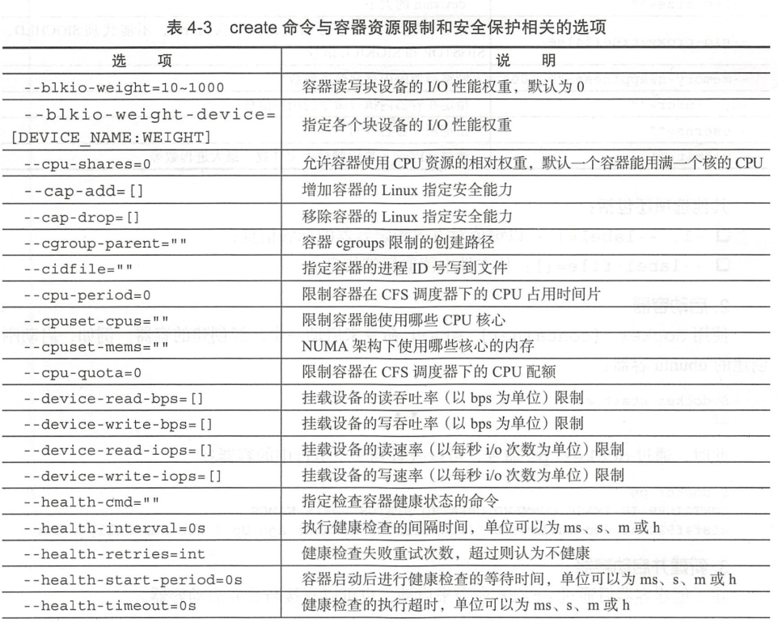 



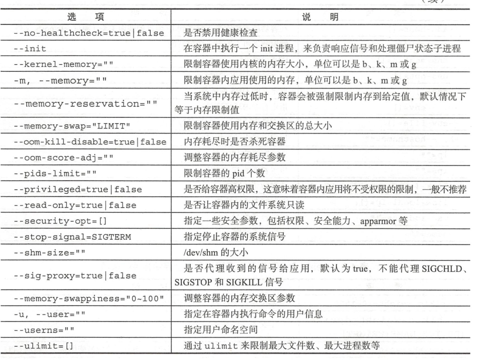 

**这些选项很多，还是需要在实践中掌握，现在只需要知道，在创建容器时，可以指定多个选项就可以了。**

**守护状态运行**

`docker run -d ubuntu /bin/sh -c "while true; do echo hello world; sleep l; done"`

**容器run运行**

`docker run  -p 本地端口:服务端口 -d name:tag`

这个命令就好比执行了 `docker create ImageName:tag` 和 `docker start CONTAINER`两个命令

当利用 docker [container] run 命令时，其中完成了多步骤，主要是完成虚拟机运行的环境等。



 

当执行`docker run -it ubuntu:1B.04 /bin/bash`（**-t** 选项让 Docker 分配一个伪终端（ pseudo-tty）并绑定到容器的标准输入上， **-i**
则让容器的标准输入保持打开，简单说，就是以交互模式执行）时，会进入容器的bash。当退出时，可执行ctrl+D或者exit命令。但是，当执行exit命令时，容器也会停止，     
这是因为当其中的应用退出后，容器的使命也就完成了，没有继续运行的必要了（尚没有测试，如果有应用运行时会不会退出）。

可以使用`docker container wait CONTAINER [CONTIANER...]`子命令来等待容器退出，并打印返回结果。它呈现阻塞态，知道容器退出。想检验的话，可以运行一个容器，        
执行命令，并再领一个命令窗口关闭容器，观察原来命令阻塞窗口的输出。

**查看容器输出**

`dcoker [container] logs CONTAINER`

**-details** 打印详细信息

**-f** 持续保持输出

**-since string** 从某个时间开始的日志

**-tail string** 输出最近的若干日志

**-t,-timestamps** 显示时间戳信息

**-until string** 输出某个时间之前的日志

### 3.容器停止

**暂停容器**

`docker pause CONTAINER`

恢复 `docker unpause CONTAINER`

**终止容器**

`docker stop [-t | --time [=10]] [CONTA工NER ... ］`

该命令会先向容器发送SIGTERM信号，默认10s后再发送SIGKILL信号来终止容器。

当容器停止时，再执行`docker container prune`，会清除停止状态的容器

另外，如果直接执行 `docker [container] kill`  则会直接发送SIGKILL停止容器。

**重启容器**

`docker [container] restart CONTAINER`

### 4.进入容器

**1.attch**

使用attach接入标准输入输出

`docker [container] attach [--detach-keys[=[]]] [--no-stdin] [--sig-proxy[;true]] CONTAINER`

**--detach-keys[=[]]**:指定返回快捷键序列默认 ctrl-p ctrl-q

**--no-stdin=true|false** : 是否关闭标准输入，默认开启

**--sig-proxy=true|false** :是否代理收到的信号给系统进程，默认为true；

**多个窗口同时attach时，一个窗口发生阻塞会影响其它窗口。**

**2.exec**

在Docker 1.3.0 之后提供此命令，可以在运行中容器内执行任何命令

`docker [container] exec [-d | -detach] [--detach-keys[=[]]] [-i|--interactive] [ - -piivileged］[-t | --tty] [ -u | --user [=USER]] CONTAINER COMMAND ［ARG ...]`

**-d,--detach**: 在容器后台执行命令

**--detach-keys=""**:指定将容器切回后台的按键

**-e, --env=[]**:指定环境变量列表

**-i， --interactive=true|false**:打开标准输入接受用户输出命令，默认值为false。

**--privileged=true|false**:是否给执行命令以高权限，默认为false。

**-t, --tty=true|false**:分配伪终端，默认false

**-u，--user="" **: 指定命令的用户或ID

例如：     
`docker exec -it CONTAINER /bin/bash`

**推荐使用这一种**

### 4.删除容器

`docker [container] rm`

命令格式：docker [container] rm [-f | － force) [-l|--link] [-v|--volumes] CONTAINER [CONTAINER ... ] 

**-f, --force=false** ： 是否强行终止并删除一个运行中的容器 ；
**-l, --link=false** ：删除容器的连接 ，但保留容器；
**-v, --volumes=false** ：删除容器挂载的数据卷 。

### 5.导出容器

`docker [container] export -o| --output [=""]] CONTAINER`

例如：     
`docker export -o d:/ubuntu.tar CONTAINER_ID`

**-o** 指定路径

### 6.导入容器

`docker import [-c|--change[=[]]] [-m| -- message[=MESSAGE]] file|URL|- [REPOSITORY [:TAG]]`

**-c** 选项在导人的同时执行对容器进行修改的 Dockerfile指令 （可参考后续相关章节）。

例如：     
`docker import -m "redis导入"  d:/redis.tar redisImport:0.1`

无论容器是否运行，都可以用该命令导出，导出的也可以称作容器的快照

### 7.查看容器

**查看容器详情**

`docker container inspect [OPTIONS] CONTAINER [CONTAINER...］` 会以json的形式返回

**查看容器内的进程**

`docker [container] top [OPTIONS] CONTAINER [CONTAINER...]` 类似于linux中的top命令

**查看统计信息**

docker [container] stats [OPTIONS] [CONTAINER...] 会显示 CPU 、内存、存储、网络等使用情况的统计信息

**-a, -all** ：输出所有容器统计信息，默认仅在运行中；
**--format string** ：格式化输出信息,
**--no-stream** ：不持续输出，默认会自动更新持续实时结果；
**--no-trunc** ：不截断输出信息 。

### 8.其他容器命令

**复制**

`docker [container] cp [OPTIONS] CONTAINER:SRC_PATH DEST_PATH `或者`docker [container] cp [OPTIONS] DEST_PATH CONTAINER:SRC_PATH `通过目标地址和容器
地址交换来指定复制方向

**-a, -archive** ：打包模式，复制文件会带有原始的 uid/gid 信息；

**-L, -follow-link** ：跟随软连接。当原路径为软连接时＼默认只复制链接信息，使用该选项会复制链接的目标内容

例如;

`docker cp data test:/tmp`

**查看端口映射**

`docker container port CONTAINER [PRIVATE_PORT[/PROTO ]]`

**查看变更** 

`docker [container] diff CONTAINER`

**更新配置**

`docker [container] update [OPTIONS] CONTAINER [CONTAINER...］`

 blkio-weight uintl6 ：更新块 IO 限制， 10～ 1000 ，默认值为 0 ，代表着无限制；      
-cpu-period int ：限制 CPU 调度器 CFS (Completely Fair Scheduler）使用时间，单位为微秒，最小 1000;      
-cpu-quota int ：限制 CPU 调度器 CFS 配额，单位为微秒，最小 1000;        
-cpu-rt-period int ：限制 CPU 调度器的实时周期，单位为微秒 ；       
-cpu-rt-runtime int ：限制 CPU 调度器的实时运行时，单位为微秒；      
-c, -cpu-shares int ： 限制 CPU 使用份额；      
-cpus decimal ：限制 CPU 个数；       
-cpuset-cpus string ：允许使用的 CPU 核，如 0-3, 0,1;        
-cpuset-mems string ：允许使用的内存块，如 0-3' 0, 1;        
-kernel-memory bytes ：限制使用的内核内存；        
-m, -memory bytes ： 限制使用的内存；        
-memory-reservation bytes ：内存软限制；       
-memory-swap bytes ：内存加上缓存区的限制， － 1 表示为对缓冲区无限制；     
-restart string ： 容器退出后的重启策略。       

# 数据卷

数据卷就是提供给容器使用的特殊目录，将本地目录（主机目录）映射进容器内部，类似linux的mount行为。

### 数据卷创建，查看，销毁
**创建数据卷**

`docker volume create -d local test` 未找到指定位置创建数据卷，也不知道创建的保存的了哪。保存到了用户目录下好像

**查看数据卷**

`docker volume ls`

**删除数据卷**

`docker volume rm name`

**清除无用的数据卷**

`docker volume prune`

### 绑定数据卷

将本机任意路径挂载到容器作为数据卷，这种形式创建的数据卷称为绑定数据卷

在使用 `docker [container] run -mount ...`来指定使用数据卷。

-mount有3中类型

volume:普通数据卷，映射到主机/var/lib/docker/volume下       
bind:绑定数据卷，映射到指定目录下     
tmpfs:临时数据卷，只存在于内存中

例如：将/tmp目录挂载到/opt/webapp下

`docker run -d -P --name web --mount type=bind,source=/tmp,destination=/opt/webapp ubuntu:0.1 java -jar web.jar`        
等同于旧命令      
`docker run -d -P --name web -v /tmp:/opt/webapp ubuntu:0.1 java -jar web.jar`

这样的功能用于测试非常方便，**另外本地的路径必须是绝对路径**，如果目录不存在docker会自动创建。

Docker挂载数据卷默认是读写（rw）权限，用户也可以通过ro指定为只读：

`docker run -d -P --name web -v /tmp:/opt/webapp:ro ubuntu:0.1 java -jar web.jar`

**ro：指定为只读**

如果直接挂载一个文件到容器，使用文件编辑工具，包括 vi 或者 sed --in-place
的时候，可能会造成文件 inode 的改变 。 从 Docker 1.1.0 起，这会导致报错误信息。**所以推
荐的方式是直接挂载文件所在的目录到容器内,这样操作挂载目录或者容器目录，都会起到同样的效果**。

**注意**      
当我们在使用docker进行挂载的时候，win10下也会遇到防火墙的问题，如下：        



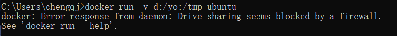       

这是因为docker虚拟机需要445端口进行本机通讯，而防火墙可能仅用了它。      



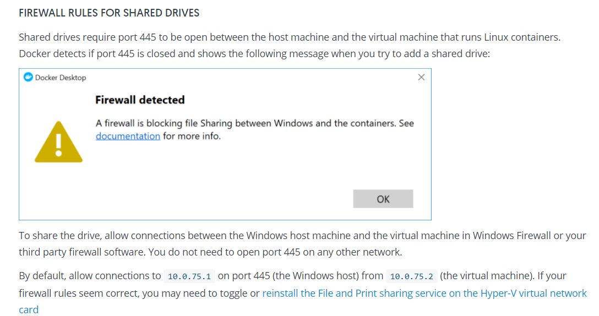         
*图片来源于*[docker-document](https://docs.docker.com/docker-for-windows/#firewall-rules-for-shared-drives)

当我如查看windows防火墙的时候，发现我为了防止比特币仅用了445，135接口，如图：



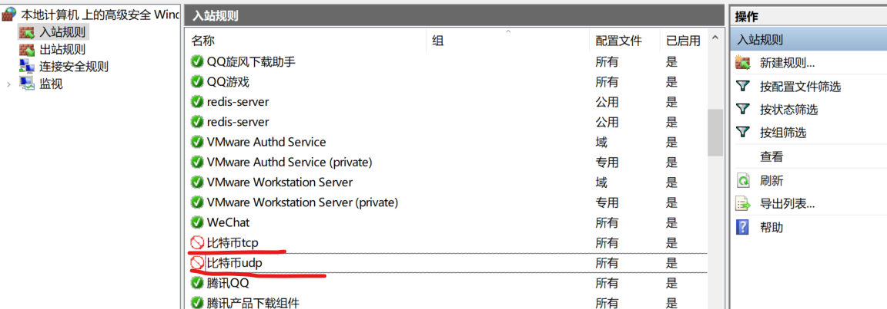



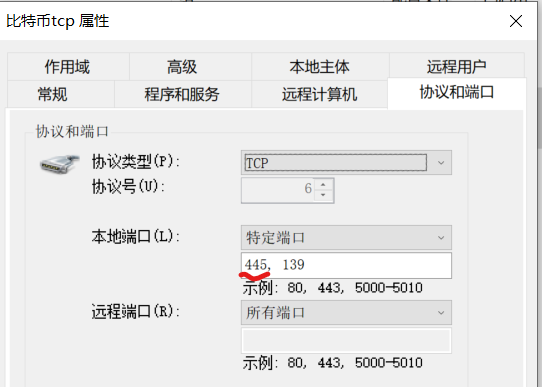

这样的话，我猜想防火墙一定设有通过规则，摸索下发现在**本机主体选项**中可以指定例外用户跳过规则，而且我也顺利找到了，docker-user如下图：



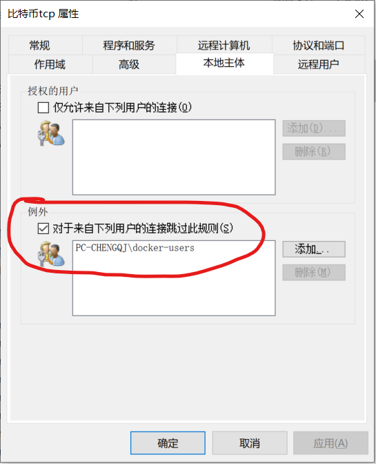

点击添加，选择本地用户



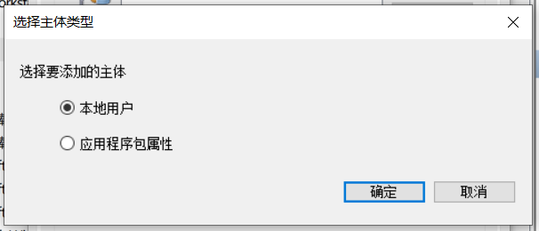

点击高级，之后点击查找，找到docker-users


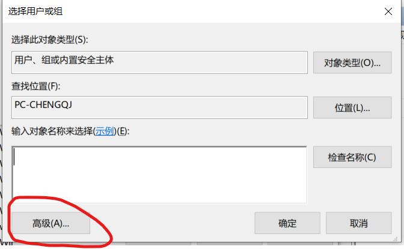


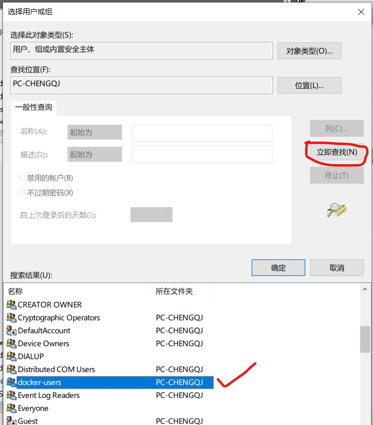

保存，就添加成功


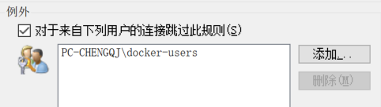

然后就可以挂载了。

### 数据卷容器

如果用户需要在多个容器之间共享一些持续更新的数据，最简单的方式是使用数据卷容器。数据卷容器也是一个容器，但是它的主要目的是专门提供数据卷给其他容器挂载。

**1.先创建一个数据卷容器**

`docker run -it -v /dbdata --name dbdata ubuntu` 这将会在容器中创建/dbdata目录

然后我们用 --volumes-from来挂载

`docker run -itd --volumes-from dbdata --name dbdata2 ubuntu` 这会使容器dbdata2挂载到dbdata容器中的/dbdata目录，两个容器将共享这个目录

**使用 --volumes-from 挂载数据卷的容器，并不需要保持自身运行。**

**删除容器并不会删除数据卷，如果想删除数据卷，需要加`-v`，例如：`docker rm -v CONTAINER`**

**2.可以利用数据卷容器来迁移数据**

1）备份dbdata

`docker run -volumes-from dbdata -v $(pwd):/backup - -name worker ubuntu tar cvf /backup/backup.tar /dbdata`

思路就是另起一个容器，关联dbdata，同时将当前目录和容器的备份目录关联起来，这样执行备份命令，就同步备份到本机。

个人觉得还不如直接关联本机。

2）恢复dbdata

先起一个容器，创建dbdata数据卷 

`docker run -v /dbdata --name dbdata2 ubuntu /bin/bash `

然后另起一个容器，挂载它的数据卷，并将备份目录与本地备份目录关联，然后执行恢复（解压缩）。

`docker run --volumes-from dbdata2 -v $(pwd):/backup busybox tar xvf /backup/backup.tar`

# 端口映射

Docker除了可以通过**网络通信**外，可以通过**映射容器服务端口到宿主机端口**，或者通过**互联机制**，实现多个容器间通过容器名访问

### 端口映射实现容器访问

当容器中运行一些网络应用， 要让外部访问这些应用时， 可以通过-P或-p参数来指定端口映射。当使用平（大写的）标记时， Docker 会随机映射一个 49000-49900 的端口
到内部容器开放的网络端口：

**1.-P参数**：

`docker run -P redis` 

**2.-p 参数**

`docker run -p 8080:6379 redis`

还可以映射多个端口

`docker run -p 8080:6379 -p 8081:80 redis`

**3.映射到指定地址指定端口**

`docker run -d -p 127.0.0.1:5000:5000 training/webapp` 这里指定了ip地址**127.0.0.1:5000**

**4.映射到指定地址的任意端口**

`docker run -d -p 127.0.0.1::5000 training/webapp` 这里指定了ip但没有指定端口**127.0.0.1:**

**5.查看端口配置**

`docker port nostalgic_rorse 5000`

**注意**

容器有自己的内部网络和IP地址，使用**docker [container) inspect＋容器ID**可以获取容器的具体信息

### 互联机制实现便捷互访

指在源容器和接收容器之间创建联系，接收容器可以通过容器名来快捷访问到源容器，而不用指定IP

**1.自定义容器名**

**--name**：来命名容器

`docker run --name web name:tag`

在执行docker [container] run的时候如果添加--rm标记，则容器在终止后会立刻删除。注意，--rm 和-d参数不能同时使用     
`docker run -rm name:tag`

**2.容器互联**

先创建一个容器

`docker run --name db name:tag`

然后互联

`docker run -d -P --name web2 --link db:db name:tag ` 其中 --link 格式为 **--link name:alias** name是连接的容器名，alias是别名

查看（docker ps -a）的时候，会发现 web2的name有**web2，web2/db**，这表明两个虚拟容器之间建立了互联，不用映射端口到宿主机，     
同时没有指定 -p和-P，从而避免暴露数据库服务到外部网络。

**Docker公开连接信息**       

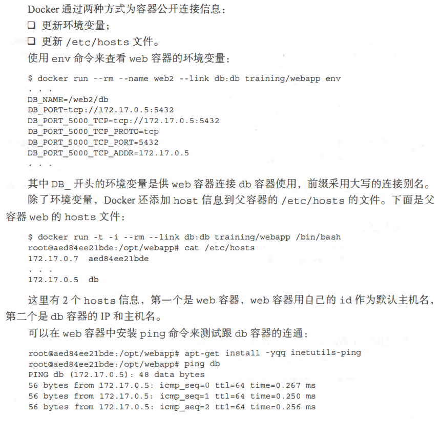

# Dockerfile创建镜像

这里没有Dockerfile范本，后期会补上，同时推荐去DockerHub上去看优秀的镜像范本。来学习怎么去写Dockerfile

### Dockerfile基本结构

一般而言，Dockerfile主题内容分为四部分：

**基础镜像信息      
维护者信息       
镜像操作指令      
启动时执行指令**

主体部分首先使用FROM指令指明所基于的镜像名称，接下来一般是使用LABEL指令说明维护者信息。
后面则是镜像操作指令，例如RU指令将对镜像执行跟随的命令。每运行一条RU指令，
镜像添加新的一层，并提交。最后是CMD指令，来指定运行容器时的操作命令。

### Dockerfile指令

Dockerfile是由**指令 + 参数**构成的。

**配置指令**

| 指令 | 说明 |
|---|---|
| ARG  |  定义镜像创建过程中使用的变量  |
|  **FROM** | **指定所创建镜像的基础镜像**  |
|  **LABEL** | **为生成的镜像添加元数据标签信息**  |
|  **EXPOSE** | **声明镜像内服务监听的端口**  |
| ENV  |  指定环境变量 |
| **ENTRYPOINT** | **指定镜像的默认入口命令** |
| VOLUME | 创建一个数据卷挂载点 |
| USER | 指定运行容器时的用户名或UID |
| WORKDIR | 配置工作目录 |
| ONBUILD | 创建子镜像时指定自动执行的操作指令 |
| STOPSIGNAL | 指定退出的信号值 |
| HEALTHCHECK | 配置所启动容器如何进行健康检查 |
| SHELL | 指定默认shell类型 |

**操作指令**

| 指令 | 说明 |
|---|---|
| RUN  | 运行指定命令  |
| CMD  | 启动容器时指定默认执行的命令  |
|  ADD |  添加内容到镜像,远程推荐ADD |
|  COPY | 复制内容到镜像，本机推荐用COPY  |

---

### 配置指令

**ARG**

`ARG <name>[=<defaulT value>]`

例如：ARG path=/webapp

在执行 docker build 时，可以通过 -build-arg[=]来为变量赋值。 当镜像编译成
功后， ARG 指定的变量将不再存在 (ENV 指定的变量将在镜像中保留）

Docker 内置了一些镜像创建变量， 用户可以直接使用而无须声明， 包括（不区分大小
写） HTTP_PROXY 、 HTTPS_PROXY 、 FTP_PROXY 、 NO_PROXY。

**FROM**

指定所创建镜像的基础镜像

格式为 `FROM <image> [AS <name>]` 或 `FROM <image>:<tag> [AS <name>]`或`FROM <image>@<digest> [AS <name>]`

`ARG VERSION=9.3`
`FROM debian:${VERSION}`

任何 Dockerfile 中第 一条指令必须为 FROM 指令。并且，如果在同 一个 Dockerfle 中创
建多个镜像时， 可以使用多个 FROM 指令（每个镜像一次）。
为了保证镜像精简， 可以选用体积较小的镜像如 Alpine或Debian 作为基础镜像。 

**LABEL**

LABEL 指令可以为生成的镜像添加元数据标签信息。 这些信息可以用来辅助过滤出特
定镜像。

格式为 `LABEL <key>=<value> <key>=<value> <key>=<value> ...`。

**EXPOSE**

声明镜像内服务监听的端口。

格式为 `EXPOSE <port> [<port>/<protocol>...]`

例如：`EXPOSE 22 80 8443`

**ENV**

指定环境变量， 在镜像生成过程中会被后续RUN指令使用， 在镜像启动的容器中也会存在。

格式为 `ENV <key> <value>`或`ENV <key>=<value>`

例如：     
`ENN APP VERS工ON=l.0.0`       
`ENV APP_HOME=/usr/local/app`     
`ENV PATH $PATH:/usr/local/bin`       

指令指定的环境变量在运行时可以被覆盖掉， 如 docker run --env <key>=<value> built_image。      
注意当一条 ENV 指令中同时为多个环境变量赋值并且值也是从环境变量读取时， 会为       
变量都赋值后再更新。 如下面的指令， 最终结果为 keyl=valuel key2=value2:       
`ENV keyl=value2`     
`ENV keyl=valuel key2=${keyl)`

**ENTRYPOINT**

指定镜像的默认入口命令，该入口命令会在启动容器时作为根命令执行，所有传入值作为该命令的参数

支持两种格式：     
`ENTRYPOINT ["executable", "paraml ", "param2"]`: exec 调用执行；     
`ENTRYPOINT command param1 param2`: shell 中执行。       

此时，CMD指令指定值将作为根命令的参数。       
每个 Dockerfile 中只能有一个 ENTRYPOINT,当指定多个时，只有最后一个起效。      
在运行时，可以被 --entrypoint 参数覆盖掉，如 docker run --entrypoint。

**VOLUME**

创建一个数据卷挂载点。     
格式为 `VOLUME ["/data"]`。       
运行容器时可以从本地主机或其他容器挂载数据卷， 一般用来存放数据库和需要保持的数据等。

**USER**

指定运行容器时的用户名或urn, 后续的RU等指令也会使用指定的用户身份。

格式为 `USER daemon`。        
当服务不需要管理员权限时－，可以通过该命令指定运行用户， 并且可以在 Dockerfile 中     
创建所需要的用户 。 例如：      
`RUN groupadd -r postgres && useradd --no-log-init -r -g postgres postgres `      
要临时获取管理员权限可以使用 gosu 命令 。

**WORKDIR**

为后续的 RUN 、 CMD 、 ENTRYPOINT 指令配置工作目录 。     

格式为 WORKDIR /path/to/workdir        

可以使用多个 WORKDIR 指令，后续命令如果参数是相对路径， 则会基于之前命令指定的路径 。例如 ：      
WORKDIR /a      
WORKDIR b       
WORKDIR c       
RUN pwd     
则最终路径为／ a /b /c 。       
因此，为了避免出错，推荐 WORKDIR 指令中只使用绝对路径 。

**ONBUILD**

指定当基于所生成镜像创建子镜像时，自动执行的操作指令 。

格式为 `ONBUILD [INSTRUCTION］` 。

当使用包含此命令的父镜像创建子镜像时，会首先执行 ONBUILD

由于 ONBUILD 指令是隐式执行的，推荐在使用它的镜像标签中进行标注， 例如 ruby:2.l-onbuild 。     
ONBUILD 指令在创建专门用于自动编译、检查等操作的基础镜像时，十分有用 。

**STOPSIGNAL**

指定所创建镜像启动的容器接收退出的信号值 ：      

`STOPSIGNAL signal`

**HEALTHCHECK**

配置所启动容器如何进行健康检查（如何判断健康与否），自 Docker 1.12 开始支持 。

详细在此不述。

**SHELL**

指定其他命令使用 shell 时的默认 shell 类型：

`SHELL [”executable”,”parameters ”]`

默认值为 `［"／bin/sh "，"-c"]`。

### 操作指令

**RUN**

运行指定命令 。        
格式为 `RUN <command＞或 RUN [ "executable " , ” paraml ” , ” param2 "] `

注意后者指令会被解析为 JSON 数组，因此必须用双引号 。 前者默认将在 shell 终端中运行命       
令，即／bin/sh -c ； 后者则使用 exec 执行，不会启动 shell 环境 。       
指定使用其他终端类型可以通过第二种方式实现，例如 RUN ["/bin/bash" , "-c","echo hello ”］。       
每条 RUN 指令将在当前镜像基础上执行指定命令，并提交为新的镜像层 。 当命令较长时可以使用＼来换行。 

**CMD**

CMD 指令用来指定启动容器时默认执行的命令 。

支持三种格式：
`CMD ［"executable＂，”paraml ”,＂param2 "］`：相当于执行 executable param1 param2 ，推荐方式；

`CMD command paraml param2` ：在默认的 Shell 中执行，提供给需要交互的应用；

`CMD ［ "param1"，"param2 ＂］` ：提供给 ENTRYPOINT 的默认参数 。

每个 Dockerfile 只能有一条 CMD 命令 。 如果指定了多条命令，只有最后一条会被执行。      
如果用户启动容器时候手动指定了运行的命令（作为 run命令的参数），则会覆盖掉CMD 指定的命令 。

注意：CMD,RUN还有ENTRYPOINT之间的关系，可以去网络上去查询区别，大致就是RUN会执行在docker build期间，      
而CMD和ENTRYPOINT会执行在docker run期间，当CMD和ENTRYPOINT都存在时，ENTRYPIONT要么覆盖CMD，要么把它当作参数

**ADD**

添加内容到镜像。

格式为 `ADD <SrC> <dest> `

该命令将复制指定的＜ SrC ＞路径下内容到容器中的＜ de st ＞路径下 。

其中＜ SrC ＞可以是 Dockerfile 所在目录的一个相对路径（文件或目录）；也可以是一个URL ；      
还可以是一个 tar 文件（自动解压为目录） <dest ＞可以是镜像内绝对路径，或者相对于工作目录（ WORK.DIR）的相对路径 。        

路径支持正则格式，例如：        
`ADD *.c /code/`

**COPY**

复制内容到镜像 。

格式为 `COPY <src> <dest>` 

复制本地主机的<src> （为 Dockerfile 所在目录的相对路径，文件或目录）下内容到镜       
像中的＜dest＞。目标路径不存在时，会自动创建 。      
路径同样支持正则格式。     

COPY 与 ADD 指令功能类似，当使用本地目录为源目录时，推荐使用 COPY 。

### 创建镜像

**需要多多实践**

推荐 **[第一个docker化的java应用](https://www.imooc.com/learn/824)**

# 其他 

**保持一个容器执行完不退出的一个方式是`docker run -itd ubuntu`**
